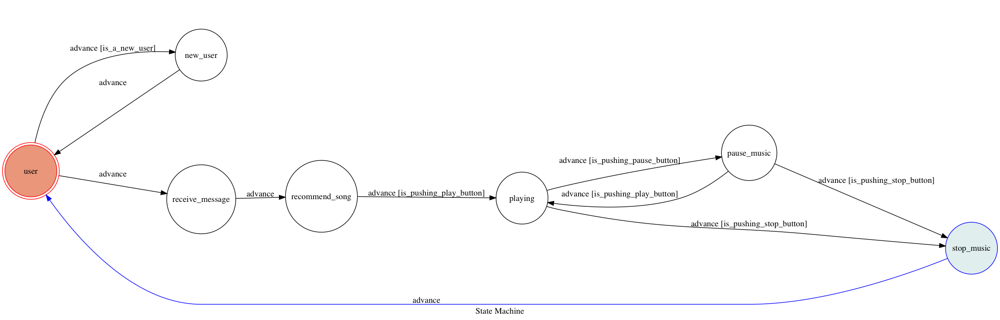

# SpotifyBot

## Setup
### Prerequisite
- Python3
- Spotify Premium
- Install Dependency
    -`pip install -r requirements.txt`

### Secret Data
- TELEGRAM_API_TOKEN
    - You can get this token from BOT FATHER when you create telegram bot.
- SPOTIFY_CLIENT_ID
    - You can get this from Spotify [Web API Authorization Guide](https://developer.spotify.com/web-api/authorization-guide/).
- SPOTIFY_CLIENT_SECRET
    - Same as above.
- WEBHOOK_URL
    - Get this when you run ngrok in terminal.
- SPOTIFY_USER_NAME
    - Your spotify user name.
- SPOTIFY_REDIRECT_URI
    - You can follow the step instruction from Spotify [Web API Tutorial](https://developer.spotify.com/web-api/tutorial/).
- SPOTIFY_TOKEN
    - When you get SPOTIFY_CLIENT_ID, SPOTIFY_CLIENT_SECRET, SPOTIFY_USER_NAME, SPOTIFY_REDIRECT_URI,
    you can use `python manage.py get_spotify_token`, and it's necessary.

## Finite State Machine

## Usage
### Step1
- When you add 'Lonely Night Music Station' as friend, you will receive welcome message.
### Step2
- You should send some text to me.
### Step3
- And then you can get a song, you can play, pause, stop this song.
### Step4
- It can just control your own spotify!

## Author
[BerniceWu](https://github.com/BerniceWu)